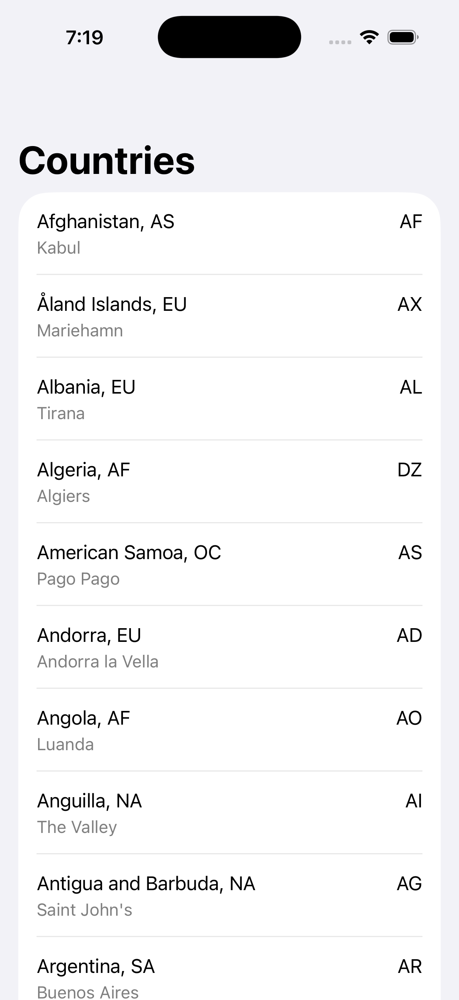
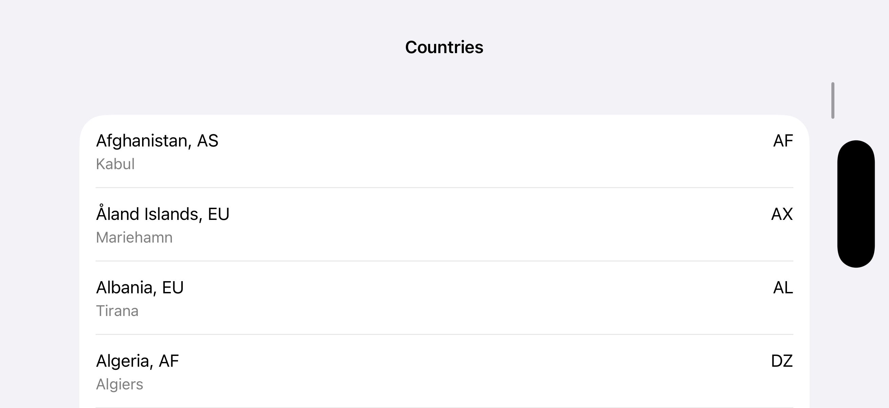

# CountriesChallenge

A SwiftUI app that fetches and displays a list of countries from a remote JSON endpoint.

## Implementation Notes

- SwiftUI for UI
- MVVM architecture
- Combine for networking
- Unit tests for ViewModel state transitions
- Handles loading, error (with retry), and empty states
- Supports portrait and landscape orientations
- Countries displayed in original JSON order
- Empty capital fields display "N/A"

## Screenshots

## Demo

A screen recording is available in the `Demo/` folder.
